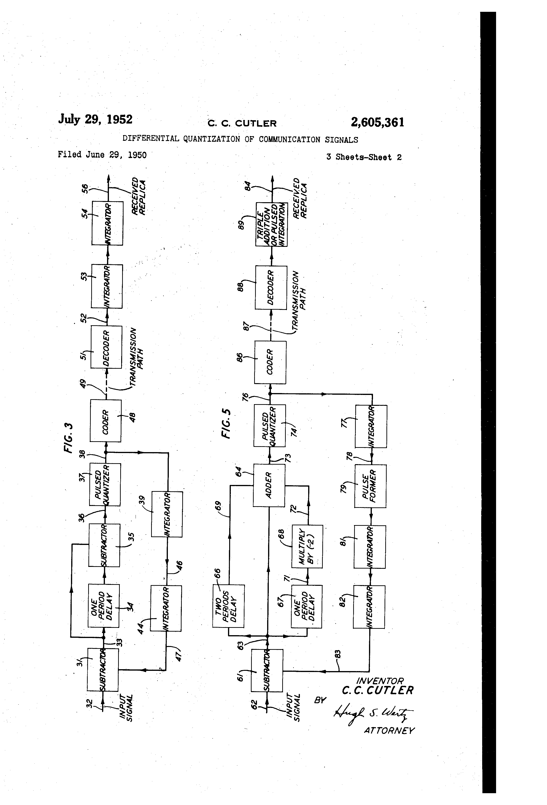
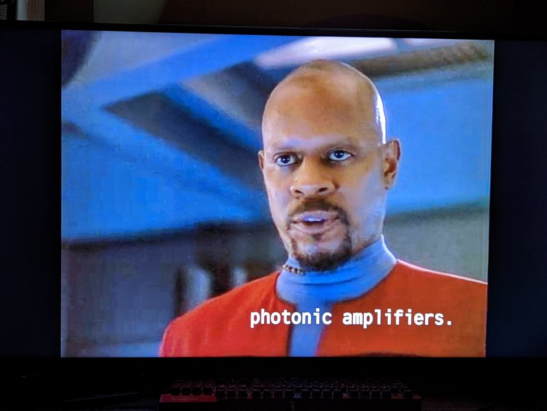

# Optics Topics

The plan is for me to take notes on papers and produce book pages with the relevant and necessary technical background information.

The current reality is assorted miscellany and placeholder text.




This is a small sample book to give you a feel for how book content is
structured.

:::{note}
Here is a note!
:::

And here is a code block:

```
e = mc^2
```

And here is Benjamin Sisko:




Check out the content pages bundled with this sample book to see more.
